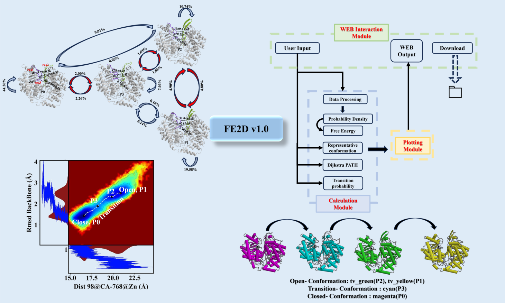

FE2D is a post-analysis program used for simulating data of allosteric proteins. It can assist researchers in constructing protein free energy landscape maps more easily. The internally integrated conformational analysis tool can assist researchers in analyzing the various conformational states of allosteric proteins and the patterns of transfer between these states.

# WEB
http://www.henu-polydb.cn/#/FE2D
